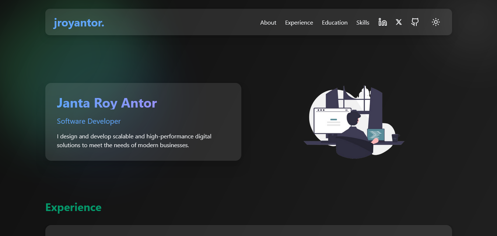

# 🌐 Personal Developer Portfolio

A modern, elegant, and responsive portfolio website built with **React**, **TypeScript**, **Vite**, and **Tailwind CSS**. This portfolio showcases your projects, skills, experience, and educational background in a minimal and stylish way with full support for **dark and light modes**.



---

## ✨ Features

- 🔄 Dark & Light mode with seamless toggle  
- 🌀 Gravitational hover background animation  
- 📂 Projects section with screenshots, tech stack, and live/code links  
- 🎓 Education & 💼 Experience sections with hover effects  
- 🚀 "Go to Top" floating button  
- 🧪 Fully customizable component-based structure  
- ⚡ Blazing fast build with Vite  

---

## 📁 Folder Structure


---

## 🚀 Installation & Setup

### 1. Clone the repository

```bash
> git clone https://github.com/your-username/your-portfolio.git
```
### 2. Goto the project folder
```bash
> cd your-portfolio
```

### 3. Install dependencies
```bash
> npm install
```
### 4. Run the project
```
> npm run dev

```

Open your browser and visit http://localhost:5173


### ⚙️ Customization Guide

### 🔧 Update Portfolio Content

-  All data is stored in the App.tsx file's as text/dictionary.

- projects: Add your projects with title, image, description, links, and stack.

- skills: Define skills in frontend/backend/others categories.

- experience, education: Define your career and academic background.

### 🎨 Styling and Themes

- Tailwind CSS is used for styling. Modify styles in tailwind.config.ts.

- Dark/light mode is handled using a tailwind utility classes.

- Component classes (text-cyan-400, etc.) define theme colors — customize as needed.


### 🛠 Build for Production

```bash
npm run build
```

### To preview the production build locally:

```bash
npm run preview
```

### 📃 License

This project is licensed under the [MIT License](https://opensource.org/license/mit).


### Designed with ❤️ by jroyantor.